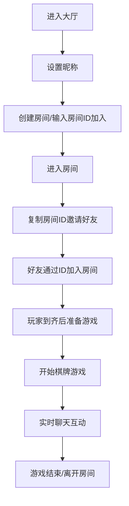

## 1. 产品概述

多人在线棋牌房间系统，用户可以创建私密房间、通过房间ID邀请好友加入，并在房间内进行实时文字聊天。系统支持多人同时在线，房间管理，以及棋牌游戏的基础交互。

- **目标用户**：想要与朋友进行在线棋牌游戏的玩家
- **核心价值**：提供简洁、快速、私密的多人在线棋牌聚会体验

## 2. 核心功能

### 2.1 用户角色

| 角色 | 注册方式 | 核心权限 |
|------|----------|----------|
| 普通用户 | 输入昵称即可加入 | 创建房间、加入房间、聊天、游戏 |

### 2.2 功能模块

1. **首页/大厅**：用户昵称设置，创建房间入口，加入房间入口
2. **房间页面**：房间信息展示，玩家列表，聊天区域，棋牌桌面，邀请信息
3. **聊天系统**：实时文字消息，系统消息提示

### 2.3 页面详情

| 页面名称 | 模块名称 | 功能描述 |
|----------|----------|----------|
| 首页 | 用户设置 | 输入用户昵称，头像选择 |
| 首页 | 房间操作 | 创建新房间按钮，通过ID加入房间表单 |
| 房间页 | 房间信息 | 显示房间ID、房间名称、房主信息、当前人数 |
| 房间页 | 玩家列表 | 显示所有在线玩家，准备状态，位置标识 |
| 房间页 | 聊天区域 | 实时文字聊天，消息列表，输入框 |
| 房间页 | 棋牌桌面 | 玩家位置分布，游戏状态显示，操作按钮 |
| 房间页 | 房间控制 | 邀请好友（复制ID），离开房间，房主解散房间 |

## 3. 核心流程

### 用户进入大厅 → 设置昵称 → 创建房间 → 分享房间ID → 好友加入 → 开始游戏

## 4. 用户界面设计

### 4.1 设计风格

- **主色调**：深绿色系 (#0f4c3a)，搭配金色点缀 (#d4af37)，营造高端棋牌会所氛围
- **辅助色**：深红色 (#8b0000) 用于按钮和重要操作，象牙白 (#fffdd0) 用于背景
- **按钮风格**：圆角矩形，微立体效果，悬停时有缩放和阴影变化
- **字体**：标题使用 "Playfair Display" 衬线字体，正文使用 "Noto Sans SC"
- **布局风格**：卡片式布局，顶部导航栏，左侧玩家列表，中间棋牌桌，右侧聊天区
- **图标风格**：使用 Emoji 配合简洁的 SVG 图标，保持典雅风格

### 4.2 页面设计概览

| 页面名称 | 模块名称 | UI 元素 |
|----------|----------|---------|
| 首页 | 用户设置 | 头像选择器，昵称输入框，优雅的渐变背景 |
| 首页 | 房间操作 | 两个主要操作卡片，悬浮动效，毛玻璃效果 |
| 房间页 | 房间信息 | 顶部信息栏，显示房间ID（可点击复制），人数统计 |
| 房间页 | 玩家列表 | 玩家卡片，显示头像、昵称、准备状态，在线标识 |
| 房间页 | 聊天区域 | 消息气泡样式，区分自己和他人消息，时间戳 |
| 房间页 | 棋牌桌面 | 六边形/圆形牌桌设计，玩家围绕四周，中央游戏区 |
| 房间页 | 房间控制 | 底部操作栏，复制邀请按钮，离开按钮 |

### 4.3 响应式设计

- 桌面端优先设计（1280px 及以上）
- 平板端：聊天区域折叠为可展开面板
- 移动端：玩家列表与聊天区域采用 Tab 切换，牌桌自适应缩放

### 4.4 动效设计

- 页面加载时的渐入动画
- 玩家加入/离开的滑入滑出效果
- 消息发送的弹跳动效
- 按钮悬停的微妙缩放和阴影加深
- 牌桌的轻微呼吸光效
