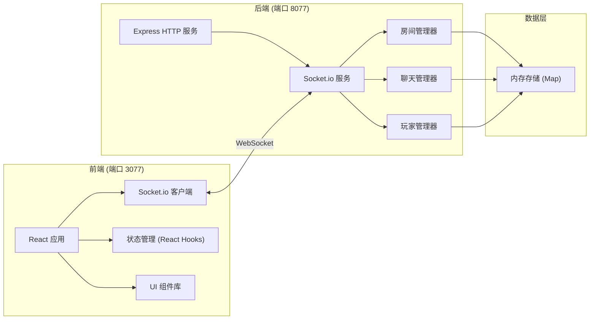
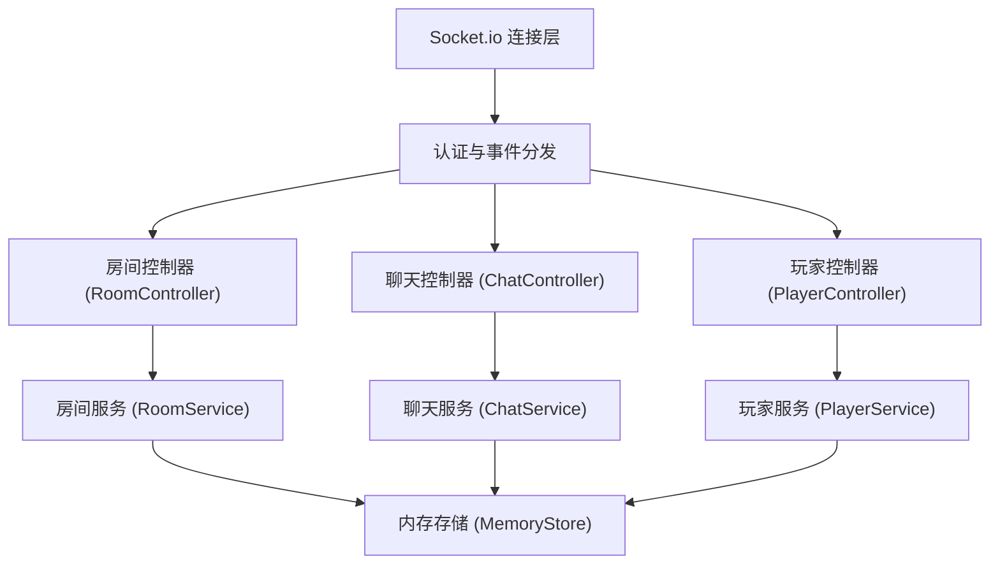
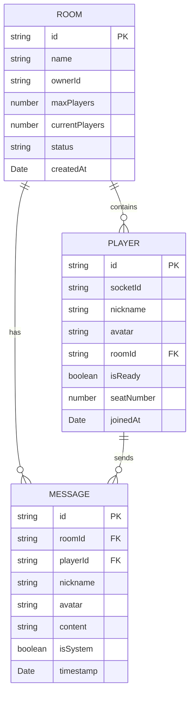

## 1. 架构设计



## 2. 技术描述

- **前端**：React@18 + TypeScript + TailwindCSS@3 + Vite + Socket.io-client
- **初始化工具**：npm create vite@latest
- **后端**：Node.js + Express@4 + Socket.io + TypeScript
- **数据存储**：内存 Map（无需持久化数据库，房间数据运行时存储）
- **实时通信**：Socket.io WebSocket 连接

## 3. 前端路由定义

| 路由 | 页面 | 用途 |
|------|------|------|
| `/` | 首页/大厅 | 用户设置昵称，创建或加入房间 |
| `/room/:roomId` | 房间页面 | 游戏房间，聊天，棋牌交互 |

## 4. 后端 API 与 Socket 事件定义

### 4.1 HTTP 接口

| 方法 | 路径 | 描述 | 请求 | 响应 |
|------|------|------|------|------|
| `GET` | `/api/rooms/:roomId` | 检查房间是否存在 | - | `{ exists: boolean, roomInfo?: Room }` |
| `GET` | `/api/health` | 健康检查 | - | `{ status: 'ok' }` |

### 4.2 Socket 事件

#### 客户端发送事件

```typescript
// 玩家事件
interface PlayerJoinData {
  roomId: string;
  nickname: string;
  avatar: string;
}

interface PlayerLeaveData {
  roomId: string;
}

interface CreateRoomData {
  nickname: string;
  avatar: string;
  roomName?: string;
}

// 聊天事件
interface ChatMessageData {
  roomId: string;
  content: string;
}

// 房间事件
interface ReadyStateData {
  roomId: string;
  isReady: boolean;
}
```

#### 服务端发送事件

```typescript
// 房间创建成功
interface RoomCreatedEvent {
  roomId: string;
  roomName: string;
  ownerId: string;
}

// 玩家列表更新
interface PlayersUpdateEvent {
  players: Player[];
}

// 新聊天消息
interface ChatMessageEvent {
  id: string;
  playerId: string;
  nickname: string;
  avatar: string;
  content: string;
  timestamp: number;
  isSystem?: boolean;
}

// 玩家加入通知
interface PlayerJoinedEvent {
  player: Player;
}

// 玩家离开通知
interface PlayerLeftEvent {
  playerId: string;
  nickname: string;
}

// 错误事件
interface ErrorEvent {
  message: string;
  code: string;
}
```

## 5. 服务端架构



## 6. 数据模型

### 6.1 数据模型定义



### 6.2 TypeScript 类型定义

```typescript
interface Room {
  id: string;
  name: string;
  ownerId: string;
  maxPlayers: number;
  currentPlayers: number;
  status: 'waiting' | 'playing' | 'finished';
  players: Map<string, Player>;
  messages: Message[];
  createdAt: Date;
}

interface Player {
  id: string;
  socketId: string;
  nickname: string;
  avatar: string;
  roomId: string;
  isReady: boolean;
  seatNumber: number;
  joinedAt: Date;
}

interface Message {
  id: string;
  roomId: string;
  playerId: string;
  nickname: string;
  avatar: string;
  content: string;
  isSystem: boolean;
  timestamp: Date;
}
```

## 7. 项目结构

### 后端结构
```
server/
├── src/
│   ├── index.ts              # 入口文件
│   ├── server.ts             # Express + Socket.io 服务配置
│   ├── types/
│   │   └── index.ts          # 类型定义
│   ├── store/
│   │   └── MemoryStore.ts    # 内存存储
│   ├── services/
│   │   ├── RoomService.ts    # 房间服务
│   │   ├── PlayerService.ts  # 玩家服务
│   │   └── ChatService.ts    # 聊天服务
│   ├── controllers/
│   │   ├── RoomController.ts # 房间事件处理
│   │   ├── PlayerController.ts # 玩家事件处理
│   │   └── ChatController.ts # 聊天事件处理
│   └── utils/
│       └── generateId.ts     # ID生成工具
├── package.json
└── tsconfig.json
```

### 前端结构
```
client/
├── src/
│   ├── main.tsx              # 入口
│   ├── App.tsx               # 根组件
│   ├── router/
│   │   └── index.tsx         # 路由配置
│   ├── pages/
│   │   ├── Lobby.tsx         # 大厅页
│   │   └── Room.tsx          # 房间页
│   ├── components/
│   │   ├── PlayerList.tsx    # 玩家列表
│   │   ├── ChatPanel.tsx     # 聊天面板
│   │   ├── GameTable.tsx     # 棋牌桌面
│   │   ├── RoomHeader.tsx    # 房间头部
│   │   └── AvatarSelect.tsx  # 头像选择
│   ├── hooks/
│   │   ├── useSocket.ts      # Socket 连接 hook
│   │   └── useRoom.ts        # 房间状态 hook
│   ├── types/
│   │   └── index.ts          # 类型定义
│   ├── utils/
│   │   └── socket.ts         # Socket 客户端
│   └── index.css             # 全局样式 + Tailwind
├── package.json
├── vite.config.ts
└── tailwind.config.js
```
